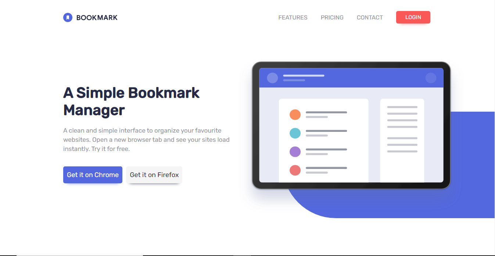

# Frontend Mentor - Bookmark landing page solution

This is a solution to the [Bookmark landing page challenge on Frontend Mentor](https://www.frontendmentor.io/challenges/bookmark-landing-page-5d0b588a9edda32581d29158). Frontend Mentor challenges help you improve your coding skills by building realistic projects. 

## Table of contents

- [Overview](#overview)
  - [The challenge](#the-challenge)
  - [Screenshot](#screenshot)
  - [Links](#links)
- [My process](#my-process)
  - [Built with](#built-with)
  - [What I learned](#what-i-learned)
  - [Continued development](#continued-development)
  - [Useful resources](#useful-resources)
- [Author](#author)
- [Acknowledgments](#acknowledgments)

**Note: Delete this note and update the table of contents based on what sections you keep.**

## Overview

### The challenge

Users should be able to:

- View the optimal layout for the site depending on their device's screen size
- See hover states for all interactive elements on the page
- Receive an error message when the newsletter form is submitted if:
  - The input field is empty
  - The email address is not formatted correctly

### Screenshot




### Links

- Solution URL: [Bookmark Github Repo](https://github.com/Oluwafemi21/bookmark)
- Live Site URL: [Bookmark Live Link](https://oluwafemi21.github.io/bookmark/)

## My process

### Built with

- Semantic HTML5 markup
- CSS custom properties
- Flexbox
- CSS Grid
- Mobile-first workflow

### What I learned
- I learned email validation using regular expressions
- I learned how to configure a tab feature using js

To see how you can add code snippets, see below:

```html
<input type="text" name="Email" id="email" placeholder="Enter your email address" required>
```

```js
validator.addEventListener('click',()=>{
    let mailformat = /^\w+([\.-]?\w+)*@\w+([\.-]?\w+)*(\.\w{2,3})+$/;
    if(email.value.match(mailformat)){
        console.log('success');
    } else{
        emailArea.style.alignItems = "start";
        emailInput.style.backgroundColor = "#fa5757";
        errorMessage.style.display = "block";
        errorIcon.style.display = "block";

        console.log(email.value);
        console.log('error');
    }
});
```

### Continued development

Learning More Of DOM

## Author

- Website - [Oluwafemi Olukoya]
- Frontend Mentor - [@Oluwafemi21](https://www.frontendmentor.io/profile/Oluwafemi21)
- Twitter - [@femi_io](https://www.twitter.com/femi_io)

## Acknowledgments
I want to thank my developer friend Kenechukwu. He helped me with some of the javascript functionality